# 如何创建一个最简单的NFT

本文的主要目的是帮助新手能够创建一个最简单的NFT，帮助各位能够最简单直观的理解NFT是什么，为后续的进一步开发打下基础。

阅读本文之前，最好需要掌握一点Solidity知识以及区块链知识。[solidity的教程推荐](https://www.wtf.academy/docs/solidity-101)

不会的话其实也没关系，你也可以根据本教程的步骤，一步一步，最后生成你自己第一个NFT

## 1、利用**OpenZeppelin**来创建合约

**OpenZeppelin**是一个非常出名的合约库，它允许开发者使用经过彻底审计的代码来开发可靠的合约，安全性非常高，比自己胡乱写安全性高多了。我们可以访问这个网站来创建一个合约。

[OpenZeppelin](https://docs.openzeppelin.com/contracts/5.x/wizard)

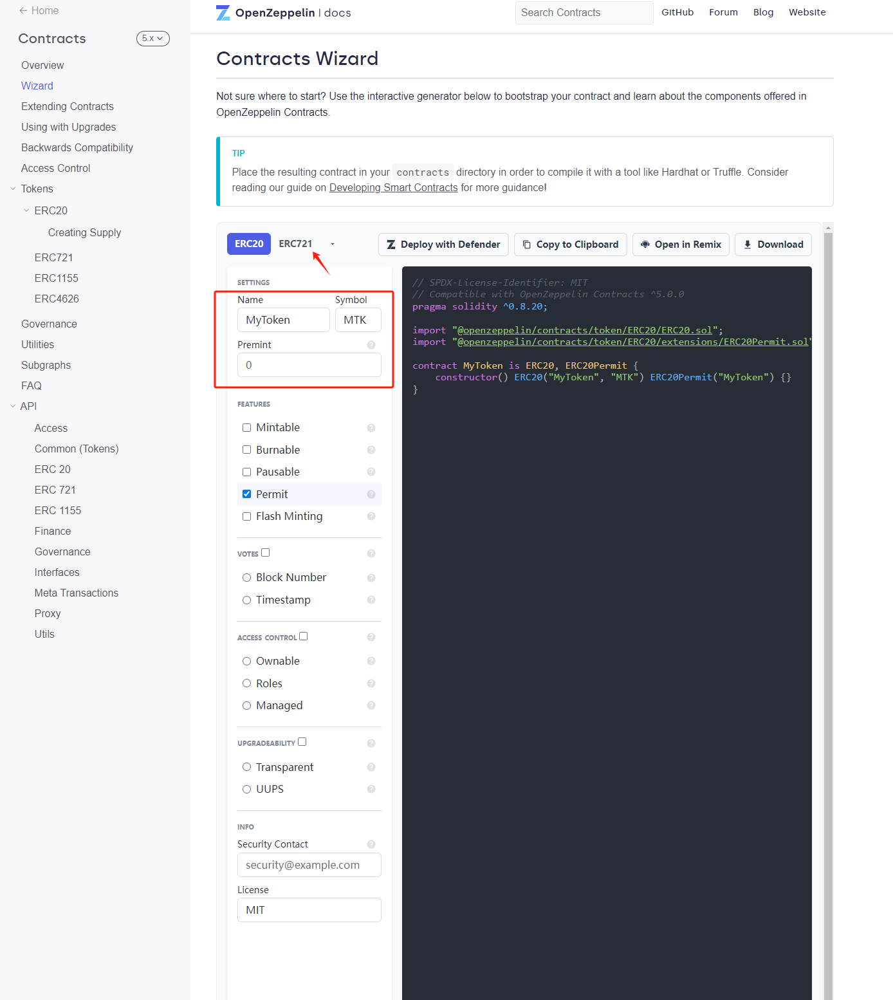

点击ERC721按钮，我们可以利用这个来创建一个自己的代币，如果不清楚什么是ERC721的话可以先学一下WTF的教程，简单来说它就是支持以太坊的一个合约协议，让使用者可以创建非同质化代币，例如我们今天要创建的NFT。

如下图所示，我们勾选一下想要的功能

name和symbol可以随便填

**Mintable**表示将创建一个由特权账户调用的Mint（铸造）函数，当然了，就是你自己的账户地址

**Autoincrement IDs**表示分配一个递增的ID，不然怎么区分是哪个NFT呢，相当于NFT的编号了

**Enumerable** 表示启用智能合约的链上令牌枚举 (on-chain Tokens enumeration) 和 “totalSupply” （总发行量）等功能，这在默认的 ERC721 集成中是没有的，具体有什么用，目前暂时不用care

**URI Storage** 以将元数据 (metadata) 和图像关联到每一个 NFT 中，也就是NFT展示的图片之类的信息，对于NFT的可视化相当重要

点击右上角的Open in Remix，可以直接把这个合约在remix中打开，相当方便。

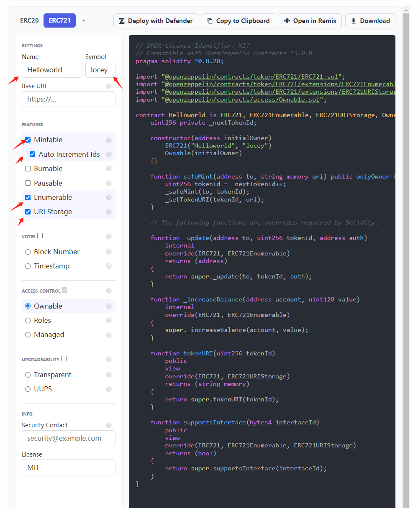

下面就是在remix里面打开的样子

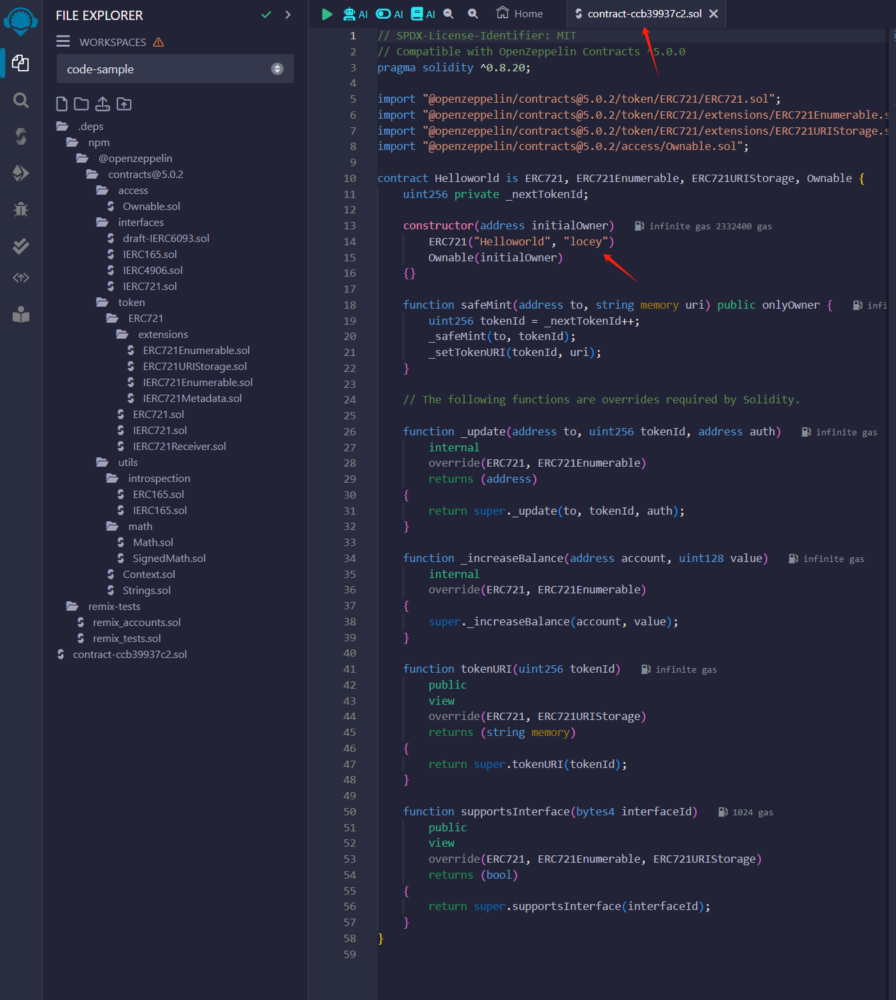

## 2、编译部署合约

现在合约已经写好了，我们该如何部署呢，首先要明确一点，合约部署是需要gas费用的，所以在部署之前，我们需要去获取一些免费的测试网代理，如Sepolia，可以使用下面的网址。（吐槽一下，有的测试网水龙头还要账户里面有ETH余额，让人非常烦躁）
[Sepolia测试网水龙头](https://faucets.chain.link/)

获取好了之后，你的钱包里面应该是有一定余额的，如下图所示，
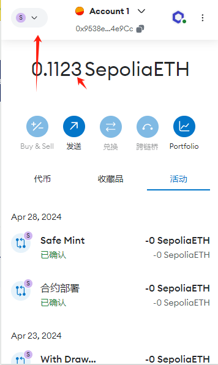

然后在remix里面进行编译和部署，编译的话就是直接ctrl+s保存就会自动编译了，部署的时候，记得更改一下环境到测试网

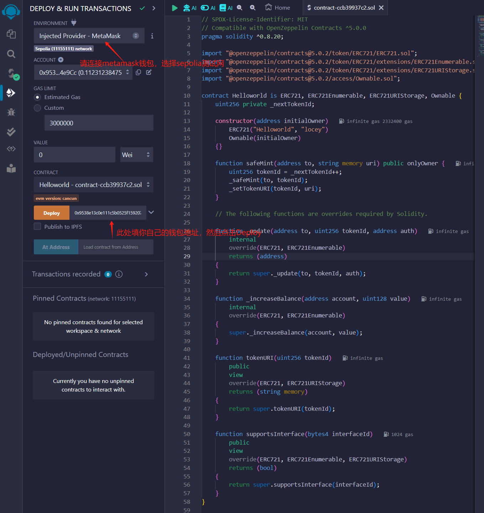

不出意外的话钱包会弹出一个页面，让你花费一点点gas费，然后就可以将这个合约部署到测试网上面啦！

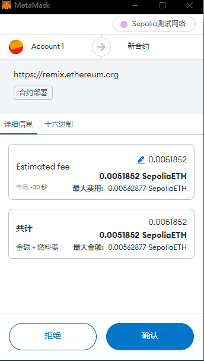

恭喜你，成功部署了自己的合约在测试网上面！
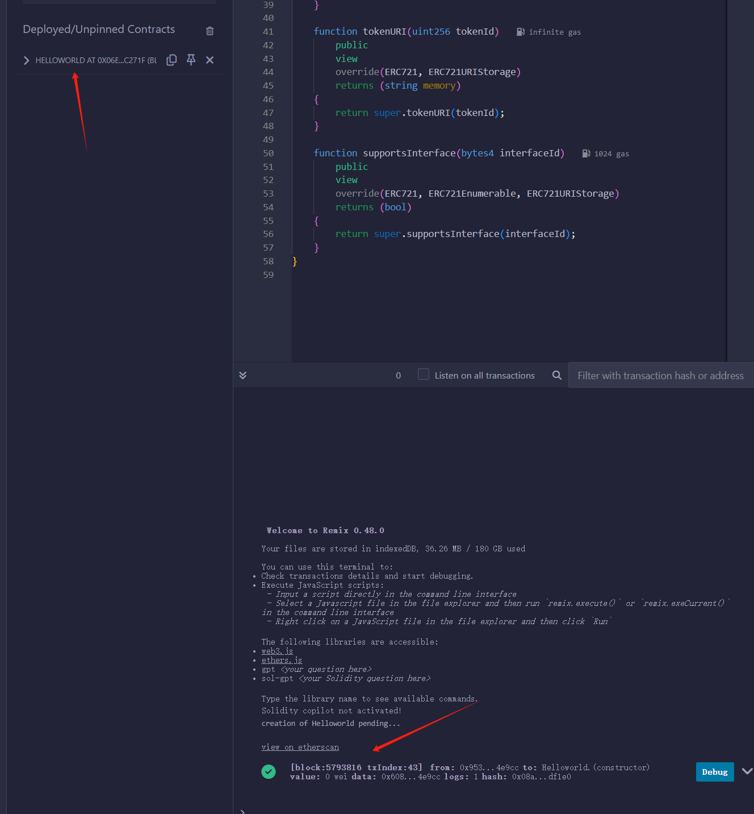

## 3、为我们的NFT创建元数据

很多人刚看到元数据可能会觉得很懵，觉得很高大上，其实元数据可以简单的理解为NFT的一个额外数据把，因为测试网上面不可能存那么大的文件，否则就要消耗巨量的gas费，所以聪明的人们想到了，我为什么不只存一个网址呢，访问这个网址就可以得到这个NFT所表示的内容，像我们常见的无聊猿NFT，这个图从哪来的呢，这一小节将为您演示。

首先根据协议要求，NFT元数据应该是存储在一个json文件中的，像下面这样

```
{ 
  "description": "YOUR DESCRIPTION",
  "external_url": "YOUR URL",
  "image": "IMAGE URL",
  "name": "TITLE", 
  "attributes": [
    {
      "trait_type": "Base", 
      "value": "Starfish"
    }, 
    {
      "trait_type": "Eyes", 
      "value": "Big"
    }, 
    {
      "trait_type": "Mouth", 
      "value": "Surprised"
    }, 
    {
      "trait_type": "Level", 
      "value": 5
    }, 
    {
      "trait_type": "Stamina", 
      "value": 1.4
    }, 
    {
      "trait_type": "Personality", 
      "value": "Sad"
    }, 
    {
      "display_type": "boost_number", 
      "trait_type": "Aqua Power", 
      "value": 40
    }, 
    {
      "display_type": "boost_percentage", 
      "trait_type": "Stamina Increase", 
      "value": 10
    }, 
    {
      "display_type": "number", 
      "trait_type": "Generation", 
      "value": 2
    }
  ]
}
```

我们目前只需要关注前面几个描述就可以了，

image是这是该项目的图像 URL。可以是几乎任何类型的图片（包括 SVG，它将被 OpenSea 缓存为 PNG），可以是 IPFS URL 或路径。我们建议使用 350 x 350 的图片。

external_url这是出现在 OpenSea 上图片下面的 URL，将允许用户离开 OpenSea，在你的网站上查看该项目。

别的我想大家看名字就知道是什么意思了，暂时不用关注attributes里面的内容。

### 在IPFS上面上传你自己的图片

我们可以访问filebase网站
[filebase](https://filebase.com/)

首先创建一个Bucket

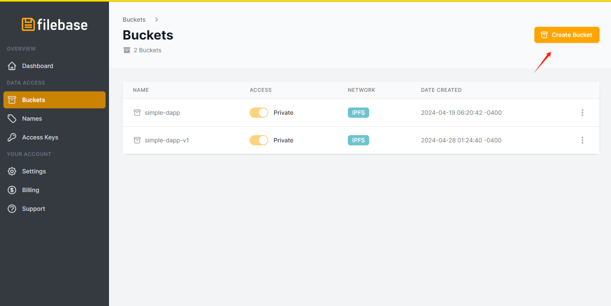

然后上传一张你自己的图片

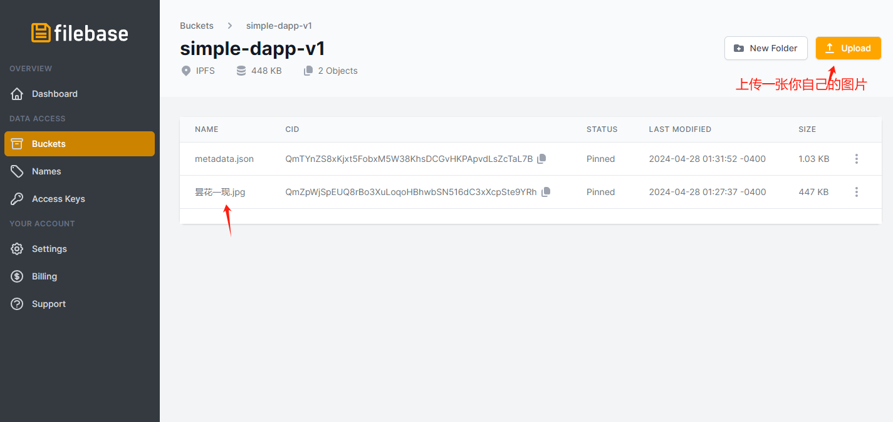

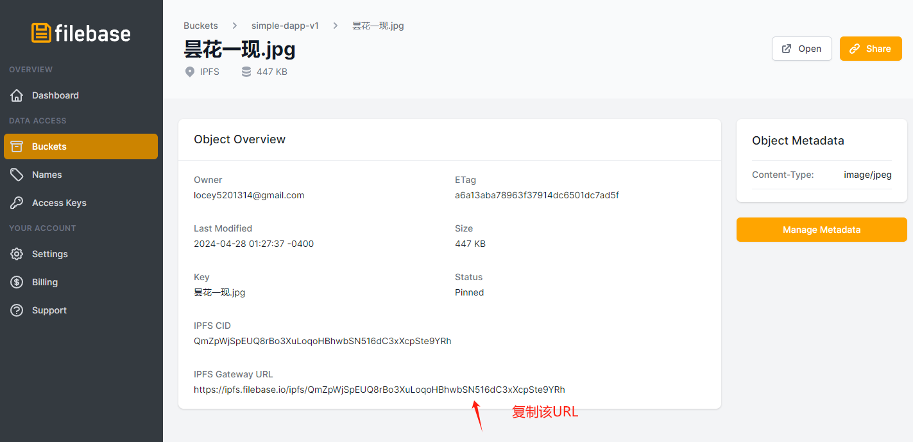

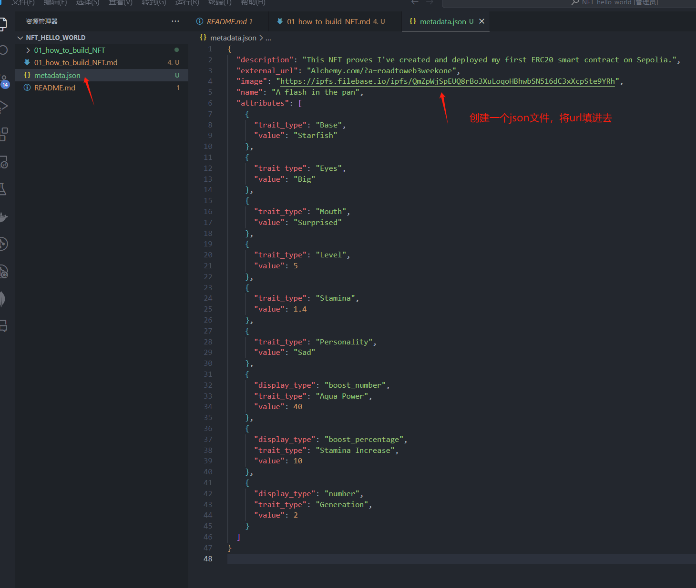

然后将该JSON文件再上传，像下面这样，然后复制CID，这样该json的ipfs链接就是：

`ipfs://QmTYnZS8xKjxt5FobxM5W38KhsDCGvHKPApvdLsZcTaL7B`

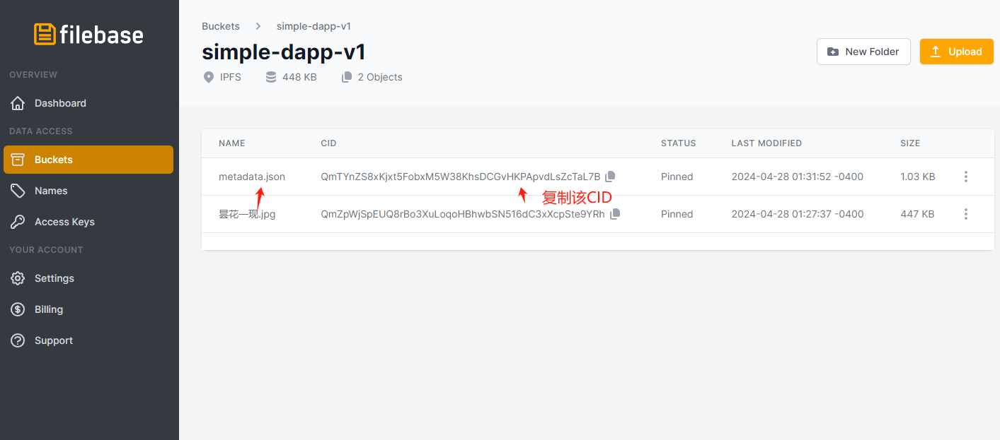

## 4、开始铸造我们的NFT

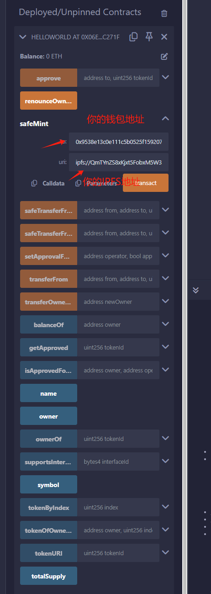

点击transact按钮，metamask钱包弹出，点击确定，这样我们就成功铸造我们第一枚NFT了！

大家可以点击各函数玩一玩，试试功能具体含义是什么
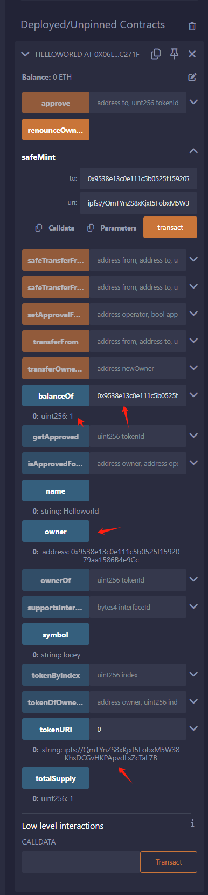

## 5、在OpenSea测试网中查看我们的NFT

访问下面的网址，使用Metamask钱包登陆，点击右上角个人资料，就可以看到我们部署的NFT啦！

恭喜你，终于创建了一个属于自己的NFT！

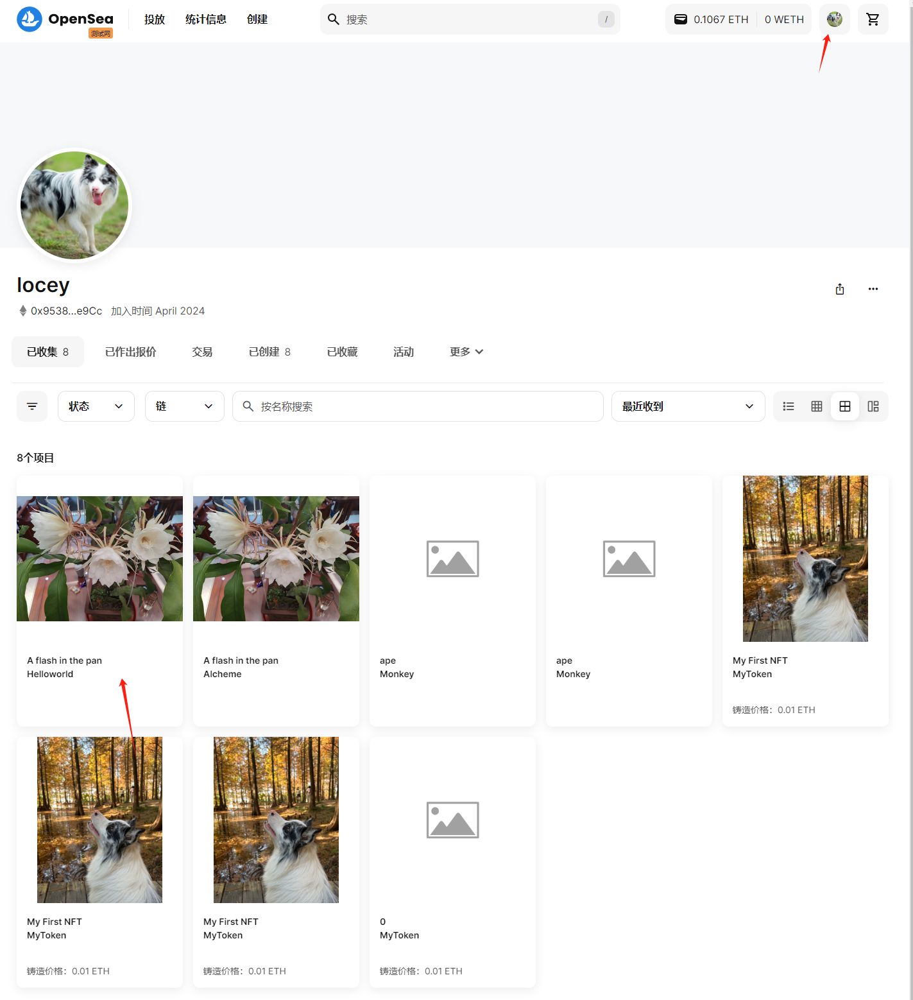

